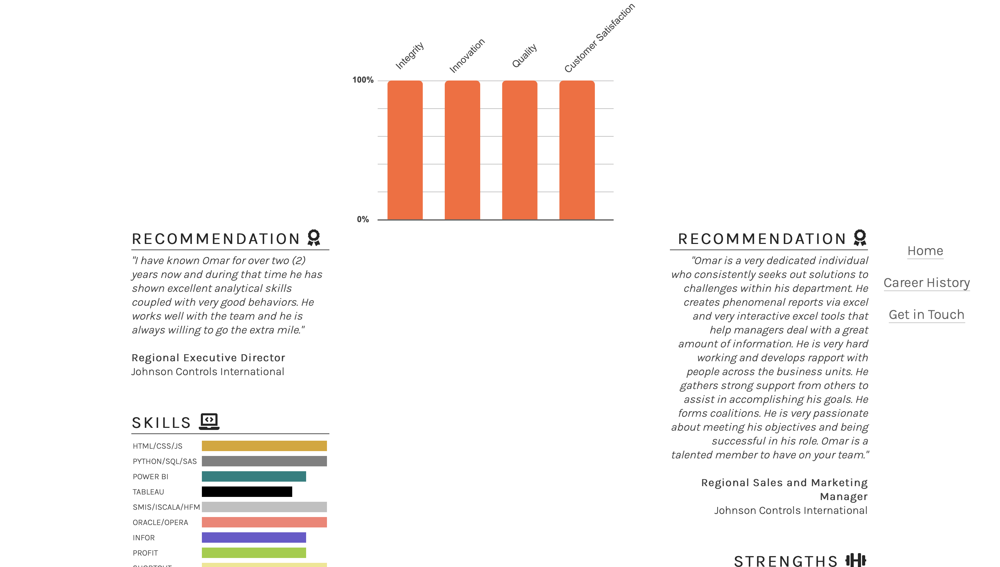

# Omar Samman Portfolio/Website

# The purpose of this project

This dynamic website was made as a portfolio for the purpose of jobs hunting.

The site contains three pages and two additional links to download 1 page cv at the home page 
and detailed cv in career history page :

1. interactive home page

2. career history page 
3. get in touch page.

## The target audience 

Employers and customers world-wide.

This website is the first of five projects that needs to be completed in order to receive a diploma in Software Development from The Code Institute.

Requirements for the project is that the website has to be static and responsive using HTML5 and CSS3.

A live version of the project can be found here -  https://sammanomar.github.io/project1/

## Table of Content

1. UX
2. User Demographic
3. Purpose of this project
4. Existing Parties
5. New Users
6. User Goals
7. Requirements
8. Design
9. Colors
10. Typography
11. Images
12. Features
13. Existing Features
14. Get in touch page
15. Footer Section
16. Form-dump page
17. Features Left to Implement
18. Technologies used
19. Testing
20. Validator Testing
21. Unfixed Bugs
22. Development and Deployment
23. Content
24. Media
25. Credits
26. UX

# 2. User Demographic

# 3. Purpose of this project

This website is meant for:

- Employers who are looking for my skill-set
- Customers who need my services

# 4. Existing parties

- As an employer: I want to be able to see the creative portfolio of Omar.
- As an employee: I want to get in touch with employers.
- As a Customer: I want to be able to contact Omar for enquiries.

# 5. New Users

- As a new User: I want to know more  Omar skill-set and capabilities.
- As a new User: I want to contact Omar for a possible job contracts.
- As a new User: I want to contact Omar for enqueries.

# 6. User Goals

Find a job and win contracts

# 7. Requirements

A static responsive website that incorporates the technologies I have learned so far that contains some advanced functionality. The development process needs to be well documented through a version controls system such as GitHub.

Required technologies: HTML, CSS

# 8. Design

As this is my first project the design has been influenced by the ”Love Running” & "Coffeeshop in Dublin" - projects. I gathered many ideas from various websites and compiled them interactively in this website

My aim has been to create a clean looking website where there is a balance between colors, images and functionality.

Omar Samman website is a 3 pages website with two addtional links to download 1 page cv and detailed cv. Menu is fixed on top in order to ensure easy navigation between the pages.

# 9. Colors

The color palette was created using white, black, light grey in compatible with the background pictures and colors.

# 10.Typography

Karla, Spectral+SC Font were chosen as the body and heading font with a fallback of Sans-Serif.

# 11. Images

Images has been chosen in accordance to color and content. The purpose of the website is to give a friendly look and express quality. Images has been sized in order to match design. Most of the pictures were directly captured by me. Only few pictures were downloaded thru from free download picures websites:

https://pexels.com
https://opencityphotos.com
https://unsplash.com/s/photos/erlangen

# 12. Features

Omar Samman website is a 3 pages website that consists of :

- Header (Logo/Menu)
- Download CV options (1 page CV as a summary in the Home page and 6 pages detailed cv in the Career history page)
- recommendations by my directs managers in the past
- dynamic and static charts
- Footer with linkedin logo an copyright

# 13. Existing Features

- Interactive sea view picture captured by me
- Interactive values chart in the first page with dynamic feature when you touch or move the cursor over the bars chart 
- Skills rows chart 
- Creative pictures captured by me
- 6 divided pictures hyperlinked directly and accurately to the expact and relevant career section in career history page
- Get in touch form, map and linked-in Footer
- Small rounded photo of me is nested right under the 1st and the 2nd page. The same applies to the 3rd page but I place a google map of my location instead of my picture. 
- My logo name is fixed on the top in order to make it easy for the user to get back to the home page
- Linkedin logo footer is connected directly to my linked in home page and get in touch page. 
- linkedin logo is fixed to the left margin of career history page and dynamically sticked when you scroll the page. I applied a change color and bigger size font freature whenever you touch the logo there.
- Interactive navigation bar that changes it's color while scrolling all the pages
- Be aware that I have put linked anchor in the footer in the 1st and last pages while have removed it from the 2nd page intentionally because I replaced it with a sticky scroll down Linkedin log instead
- 1 CV Page link has been added to the menu at the home page as a summary only while detailed CV link has been added to the career history page.
 

# 14. Get in touch page

The section contains a registration form and contact details. It also has a map that displays my location inside a round shape.
The purpose of this section is to make contact and registration as easy as possible. The User uses the form to contact me as an employer or customer. In order to establish direct contact as easy as possible the section also provides the User with a telephone number and an email. If the form is used in this version it sends the User to a form-dump page with a message.
Contact and Registration Section

# 15. Footer Section

The Footer contains a direct link to my linkedin and copyright.
The purpose of the Footer is to provide easy access for the User to my linkedin.

# 16. Form-dump page

This site contains a message when the form has been used.
The purpose of this page is to give the user an indication on that the form is working and that the message has been recived.
Form-dump page

# 17. Features Left to Implement

I am excited to apply some creative JavaScript features as soon as I start learning JS

# 18. Technologies used

HTML
CSS
Testing

# 19. Testing

Test of functionality and appearance of the website has have been dealt with thru out all stages of the development phase.

Test has been conducted using Google Chrome and Safari. Testing different devices and screen resolutions has been conducted using Google DevTools.

## Lists of main issues discovered.

- Unclosed div and p element were discovered
Solution: closed

- Download CV links didn't work correctly because of some spaces
Solution: spaces were removed and it function correctly

- Unnecessary sections wrapped ids were added wrongly
Solution: sections removed and the commands were wrapped with divs instead

- Duplicated ids were added wrong
Solution: classes were added to override the duplicated ids error

- Top menu disappears even though its fixed.
Solution: Had to use z-index to keep the menu on top of all sections and elements, value set to 20

- Apart from these issues there have been several minor issues. The majority of these has been due to miss spelled tags, attributes and other mistakes.
Solution: The errors were easily corrected.

# 20. Validator Testing

- HTML
No errors were returned when passing through the official W3C Validator
W3C HTML Validator.

Jigsaw validator

Lighthouse testing
Lighthouse testing score

# 21. Unfixed Bugs

All known bugs in this section has been moved to the section Testing with solution when they have been solved. Last known bug solved on 2022-03-16. No more testing will be conducted now and the project will be submitted.

Back to top

# 22. Development and Deployment

The development environment used for this project was GitPod. To track the development stage and handle version control regular commits and pushes to GitHub has been conducted. The GitPod environment was created using a template provided by Code Institute.

The live version of the project is deployed at GitHub pages.

The procedure for deployment followed the "Creating your site" steps provided in GitHub Docs.

Log into GitHub.
Locate the GitHub Repository that shall be deployed live.
At the top of the repository, select Settings from the menu items.
Scroll down the Settings page to the ”GitHub Pages" section and click on the ”Check it out here!”
At the ”Source” section choose ”main” as Branch and root as folder and click ”Save”
The website will deploy and the pages refreshes to provide the live link to the project.
The live link can be found here - https://sammanomar.github.io/project1/

# 23. Content

All text content on this site has been produced by the author of the project and is not fictional. It represents my real life career history and up to date portfolio.
The design of the project is inspired by Code Institutes ”Love Running” and coffeeshop in Dublin projects. Code has been borrowed from the two projects.
The icons in the header, contact and home page and footer were taken from Font Awesome.

# 24. Media

All images are taken directly by my mobile phone. They are licensed under a broad commercial license that allows them to be used in this project (Named ”P1”). The license allows usage for public purposes.

Link to license agreement
https://opencityphotos.com
https://unsplash.com/s/photos/erlangen

# 25. Credits

For code inspiration, design inputs, help and advice. Many thanks to:

My great mentor at Code Institute. She gave me many recommendations and notes.
Lauren-Nicole

Junior Web Developer - SWGFL | Hackteam: Thank you for the help with git pull problem
Kera Cudmore

Sites that has provided me with knowledge and information that has been vital to this project:

https://www.w3schools.com/ https://stackoverflow.com https://www.diffchecker.com https://www.quora.com
https://glyphs.co https://fontawesome.com https://www.coding-dude.com/

And all the content in HTML-Essentials, CSS-Essentials and the Walkthrough project ”Love Running” that has provided inspiration and knowledge.

## 5 additional screenshots

Best regards

Back to top